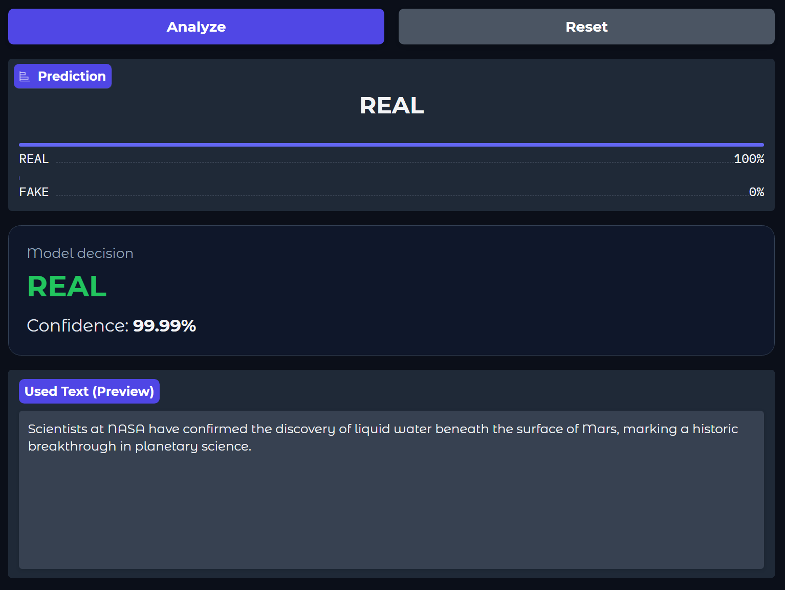

[](https://huggingface.co/ThomasTschinkel/fake-news-detector)
[](https://huggingface.co/spaces/ThomasTschinkel/fake-news-detector-demo)
[](LICENSE)
[](https://www.python.org/)

# Fake News Detector

A high-accuracy binary classifier that identifies news articles as **REAL** or **FAKE**, built on fine-tuned **RoBERTa-Large** with a custom dual-pooling classification head.

| Metric     | Score  |
|------------|-------:|
| Accuracy   | 99.81% |
| F1 (macro) | 99.81% |
| Precision  | 99.79% |
| Recall     | 99.84% |
| ROC-AUC    | 99.95% |

---

## Quick Start

### Run Locally
```bash
pip install -r requirements.txt
python app.py
# Open http://127.0.0.1:7860 in your browser
```

### Try the Live Demo
**[Launch Interactive Demo](https://huggingface.co/spaces/ThomasTschinkel/fake-news-detector-demo)**


```python
from transformers import pipeline

detector = pipeline(
    "text-classification",
    model="ThomasTschinkel/fake-news-detector",
    trust_remote_code=True,
)

results = detector([
    "NASA confirms water discovery on Mars.",
    "SHOCKING: 5G towers cause mind control!!!",
])
print(results)
```

### Manual Inference
```python
from transformers import AutoTokenizer, AutoModelForSequenceClassification
import torch

tokenizer = AutoTokenizer.from_pretrained(
    "ThomasTschinkel/fake-news-detector"
)
model = AutoModelForSequenceClassification.from_pretrained(
    "ThomasTschinkel/fake-news-detector",
    trust_remote_code=True,
)

text = "Your news article here..."
inputs = tokenizer(text, return_tensors="pt", truncation=True, max_length=512)

with torch.no_grad():
    outputs = model(**inputs)
    probs = torch.softmax(outputs.logits, dim=1)[0]

print(f"REAL: {probs[0]:.2%}  |  FAKE: {probs[1]:.2%}")
```

---

## Architecture

```
Input text
    │
    ▼
RoBERTa-Large (24 layers, 1024 hidden dim)
    │
    ├──── [CLS] token (1024-d)
    │
    ├──── Mean pooling (1024-d)
    │
    └──── Concatenate → 2048-d
              │
              ▼
     Linear(2048 → 512)
     LayerNorm + GELU + Dropout(0.3)
              │
              ▼
     Linear(512 → 128)
     GELU + Dropout(0.2)
              │
              ▼
     Linear(128 → 2)
              │
              ▼
        REAL  /  FAKE
```

**Why dual pooling?** The CLS token captures the model's "summary" representation while mean pooling preserves information from all tokens. Concatenating both gives the classifier richer signal.

---

## Dataset

Trained on [Fake News Classification](https://www.kaggle.com/datasets/saurabhshahane/fake-news-classification) from Kaggle (~6,300 articles).

- **Split:** 80% train, 20% validation
- **Languages:** English
- **Domain:** News articles
- **Balance:** Stratified split maintains class distribution

---

## Training Details

- **Base model:** `roberta-large` (355M parameters)
- **Optimizer:** AdamW
  - Backbone: 1e-5
  - Classifier head: 5e-5
- **Scheduler:** Linear warmup (10%) + linear decay
- **Batch size:** 24
- **Max sequence length:** 512 tokens
- **Early stopping:** Patience 3 on macro F1
- **Mixed precision:** FP16 (CUDA)

---

## Limitations

- **English only** — not tested on other languages
- **512 token limit** — long articles are truncated
- **Single dataset** — may not generalize to all misinformation types
- Use as a screening tool for initial classification

---

## Files

- **model.py** — Model architecture (FakeNewsDetector)
- **train.py** — Training pipeline
- **app.py** — Gradio web interface (run locally or deploy to Hugging Face Spaces)
- **requirements.txt** — Python dependencies

---

## Training

To retrain the model from scratch:

### 1. Download the Dataset
Download from [Kaggle: Fake News Classification](https://www.kaggle.com/datasets/saurabhshahane/fake-news-classification)
and place `news.csv` into the `data/` directory:

```bash
mkdir data
# Place news.csv in data/ (or use Kaggle API)
kaggle datasets download -d saurabhshahane/fake-news-classification -p data/ --unzip
```

### 2. Install Dependencies
```bash
pip install -r requirements.txt
```

### 3. Run Training
```bash
python train.py
```

The script will:
- Split data 80/20 (train/validation)
- Train for up to 20 epochs with early stopping
- Save best model to `models/bert_large.pth`
- Display metrics: Accuracy, F1, Precision, Recall, ROC-AUC

---

- **Hugging Face Model:** [ThomasTschinkel/fake-news-detector](https://huggingface.co/ThomasTschinkel/fake-news-detector)
- **Demo Space:** [ThomasTschinkel/fake-news-detector-demo](https://huggingface.co/spaces/ThomasTschinkel/fake-news-detector-demo)
- **Dataset:** [Kaggle: Fake News Classification](https://www.kaggle.com/datasets/saurabhshahane/fake-news-classification)

---

## Citation

```bibtex
@misc{tschinkel2026fakenews,
  title  = {Fake News Detector: Fine-tuned RoBERTa-Large},
  author = {Thomas Tschinkel},
  year   = {2026},
  url    = {https://huggingface.co/ThomasTschinkel/fake-news-detector}
}
```

## License

MIT

